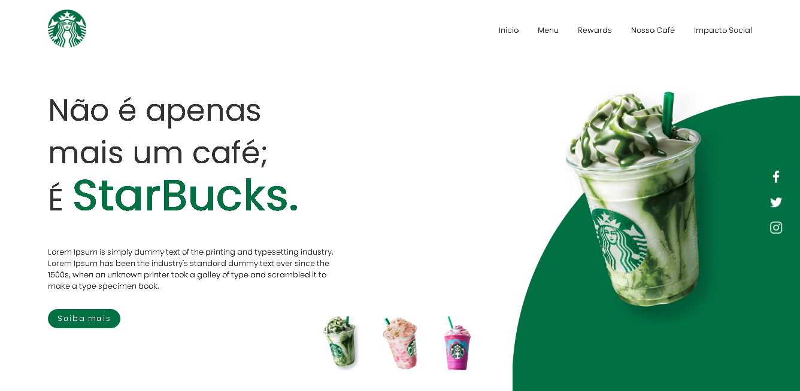

# Starbucks-Landing-Page
Criando uma landing Page da StarBucks para fins de estudo.

<h1 align="center">
Projeto DIO - StarBucks Clone
</h1>

<a href="https://www.starbucksathome.com/br/">StarBucks. Visite a page original.</a> Criada para fins de Estudo.

[Sammynauta](https://github.com/Sammynauta)

## Resources

- [x] HTML, CSS, JAVASCRIPT.
- [x] Images (JPEG, PNG)

### Slides

